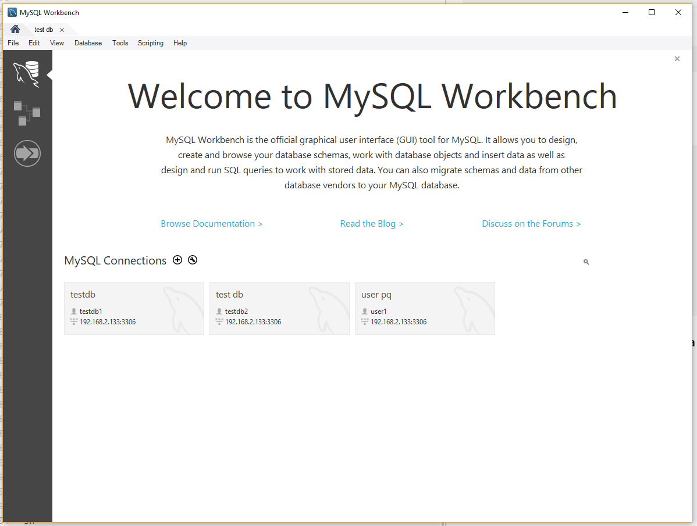
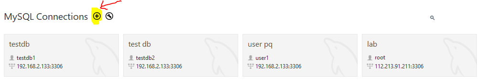
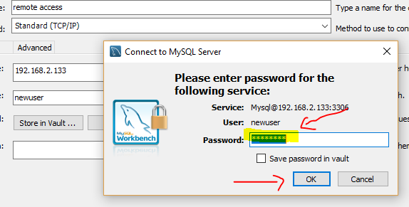
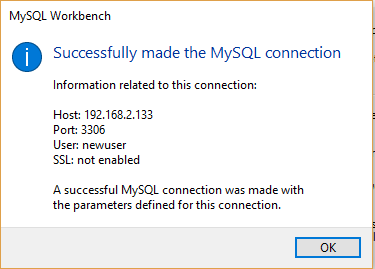
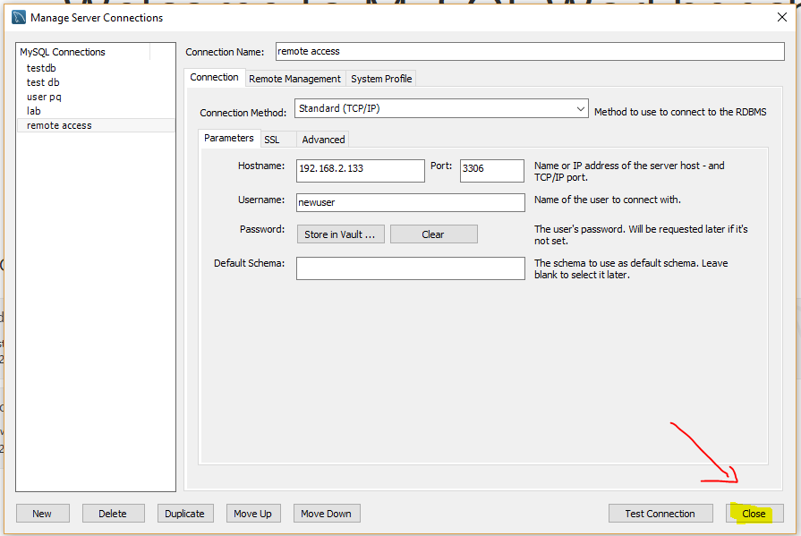
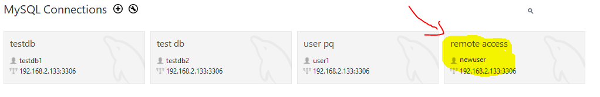
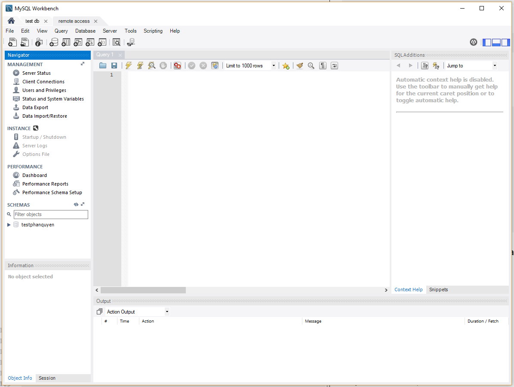

# Remote access MySQL SERVER
---
## Phần 1. Chuẩn bị
### Cài đặt MySQL

### Phần quyền MySQL

### LƯU Ý
> Để thiết lập kết nối từ xa tới MySQL SERVER cần mở port `3306`

## Phần 2. Cấu hình
> Thực hiện với quyền `ROOT`

### Bước 1: Truy cập MySQL
__Truy cập user root__

```
mysql -u root -p
```

__List user hiện có__
```
mysql> select User,Host from mysql.user;

+---------+-----------------------+
| User    | Host                  |
+---------+-----------------------+
| root    | 127.0.0.1             |
| root    | ::1                   |
|         | localhost             |
| root    | localhost             |
| testdb  | localhost             |
|         | localhost.localdomain |
| root    | localhost.localdomain |
+---------+-----------------------+

```

### Bước 2: Tạo mới, phần quyền User
> User có thể truy cập từ xa thông qua Domain

__Tạo User__

```
mysql> CREATE USER 'newuser'@'%' IDENTIFIED BY 'thanh123';
```

> Cấu trúc
```
CREATE USER '<Tên User>'@'<Domain, IP>' IDENTIFIED BY '<User PASSWD>';
```

> Lưu ý về Domain, ip khi tạo user
- ``'<user>'@'<IP>'``: IP chị định ip máy có quyền truy cập User từ xa
- ``'<user>'@'%'``: `%` cho phép tất cả pc từ xa truy cập
- ``'<user>'@'localhost'``: `localhost` chỉ localhost mới có thể truy cập

__Phân quyền User__
```
GRANT ALL PRIVILEGES ON * . * TO 'newuser'@'%';
```
Update rule
```
FLUSH PRIVILEGES;
```

__Kiểm tra User vừa tạo__
> Xem thêm tài liệu phần quyền User MySQL

```
mysql> select User,Host from mysql.user;

+---------+-----------------------+
| User    | Host                  |
+---------+-----------------------+
| newuser | %                     | # Thành công
| root    | 127.0.0.1             |
| root    | ::1                   |
|         | localhost             |
| root    | localhost             |
| testdb  | localhost             |
|         | localhost.localdomain |
| root    | localhost.localdomain |
+---------+-----------------------+
```

### Bước 3: Truy cập MySQL từ xa thông qua `MySQL GUI Tools`
> Chỉ hỗ trợ trên Windows

__Tải và cài đặt MySQL GUI Tools__

https://downloads.mysql.com/archives/gui/

> Tên app sau khi cài: `MySQL Workbench 6.x`

__Truy cập giao diện__



__Thiết lập kết nối mới__

__Bước 1: Tạo mới connection__



__Bước 2: Nhập thông tin về Host__


> Các thông tin bao gồm
- `Connection Name`: Tên kết nối
- `Hostname`: Ip hoặc Domain Host
- `Username`: Tên User kết nối từ xa
- `Port`: Mặc định 3306 (có thể thay đổi)

__Bước 3: Kiếm tra kết nối trước khi truy cập__


> Trong trường hợp thành công



__Bước 4: Chọn Ok, hoặc Close và Kết quả__



__Kết quả__



__Bước 5: Truy cập kết nối__


